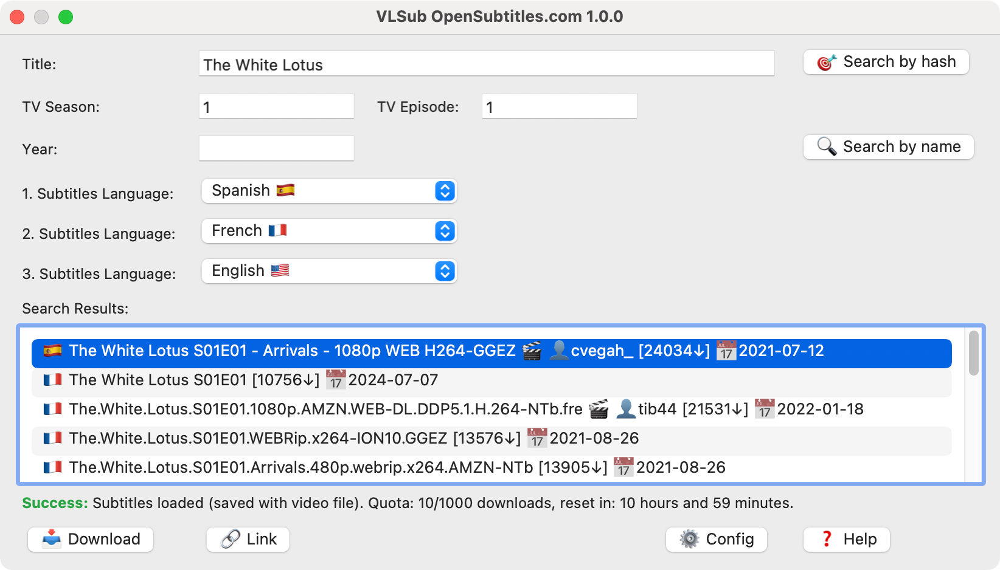
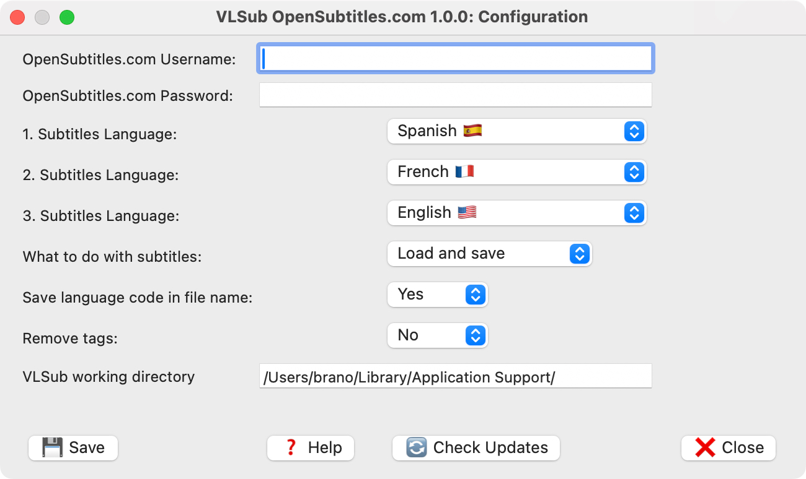
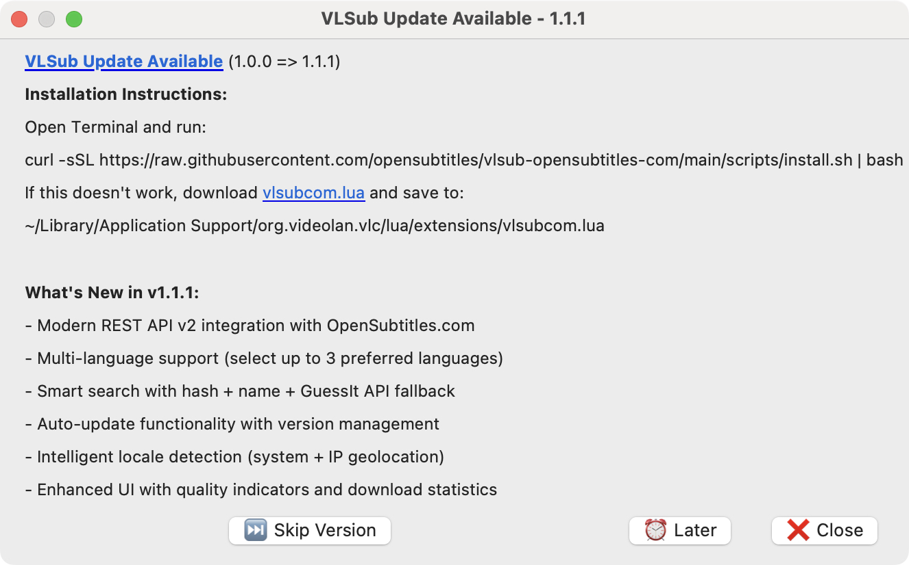

# Stremio OpenSubtitles.com Subtitle Addon

This project provides a Stremio subtitle addon that delivers Turkish subtitles from OpenSubtitles.com, Podnapisi, and subdl.com, with AI-powered sync correction, robust fallback logic, and modern quality indicators.

## 🚀 Features

- 🔍 **Smart Search**: Hash-based search for exact matches, name-based search with GuessIt integration, and robust fallback logic
- 📱 **Modern API**: Uses OpenSubtitles.com REST API v1 for better performance and reliability
- 🔄 **Auto-updates**: Always up-to-date with the latest subtitle sources and improvements
- 🎬 **Smart Metadata**: GuessIt API integration for accurate movie/TV show detection and metadata extraction
- 🏆 **Quality Indicators**: Shows trusted uploaders, download counts, sync quality (🎯 Perfect Match), and ratings
- 💾 **Flexible Download**: Auto-load subtitles or save manually with language codes, direct download for Stremio desktop/mobile
- 🤖 **AI Sync Correction**: Gemini AI-powered subtitle sync correction for perfect timing
- 🌐 **Multi-source Fallback**: Podnapisi and subdl.com fallback for maximum coverage
- 🇹🇷 **Turkish-only Filtering**: Only Turkish subtitles are provided for best user experience
- 🔗 **Easy Install**: Simple configuration UI and Stremio install link generation

## 🆚 Differences from Legacy vlsub (.org version)

| Feature                | Legacy vlsub (.org) | VLSub OpenSubtitles.com (Stremio Addon) |
|------------------------|---------------------|-----------------------------------------|
| **API**                | XML-RPC (legacy)    | REST API v1 (modern)                    |
| **Authentication**     | Optional            | Required (free account)                 |
| **Language Selection** | Single language     | Up to 3 languages with priority         |
| **Search Methods**     | Basic hash/name     | Hash + Name + GuessIt fallback          |
| **Auto-updates**       | None                | Built-in update system                  |
| **Locale Detection**   | Simple              | Advanced system detection               |
| **Quality Indicators** | Basic               | Detailed (trusted, HD, sync, etc.)      |
| **Performance**        | Slower XML parsing  | Fast JSON API                           |
| **Metadata**           | Manual input        | Smart GuessIt extraction                |

## Installation (Stremio)

1. Open the [configuration page](configure.html) to select your language and generate an install link.
2. Click the install link or copy it into Stremio's "Add addon by URL" field.
3. Subtitles will appear automatically in the player if available.

## Usage

- Subtitles are provided automatically for Turkish content in Stremio.
- Direct download is supported for desktop and mobile apps.
- 🎯 **Perfect Match** subtitles are hash-matched and guaranteed to be in sync.

## Support

- [OpenSubtitles.com](https://www.opensubtitles.com/)
- [GitHub Issues](https://github.com/opensubtitles/vlsub-opensubtitles-com/issues)

## License

This project is licensed under the MIT License.
curl -sSL https://raw.githubusercontent.com/opensubtitles/vlsub-opensubtitles-com/main/scripts/install.sh | bash
```


**Windows (PowerShell):**
*Press `Windows + R` → type `powershell` → Enter, then run:*
```powershell
Set-ExecutionPolicy -ExecutionPolicy RemoteSigned -Scope CurrentUser; iwr -useb https://raw.githubusercontent.com/opensubtitles/vlsub-opensubtitles-com/main/scripts/install.ps1 | iex
```

### Method 2: Manual Installation

1. **Download** the latest `vlsubcom.lua` from [Releases](https://github.com/opensubtitles/vlsub-opensubtitles-com/releases)
2. **Copy** to your VLC extensions directory:
   - **Windows**: `%APPDATA%\vlc\lua\extensions\`
   - **macOS**: `~/Library/Application Support/org.videolan.vlc/lua/extensions/`
   - **Linux**: `~/.local/share/vlc/lua/extensions/`
3. **Restart** VLC Media Player
4. **Access** via `View → VLSub OpenSubtitles.com`

## 📋 Requirements

- **VLC Media Player** 3.0 or newer
- **OpenSubtitles.com account** ([free registration](https://www.opensubtitles.com/newuser))
- **Internet connection** for searching and downloading
- **curl** command-line tool (for downloads - usually pre-installed)

## 🎬 Usage

### Quick Start
1. **Setup**: Open VLC → View → VLSub OpenSubtitles.com → Config
2. **Login**: Enter your OpenSubtitles.com username and password
3. **Play**: Start your video file
4. **Search**: Click "🎯 Search by Hash" for exact matches or "🔍 Search by Name"
5. **Download**: Click download and load automatically

### Search Methods

#### 🎯 Hash Search (Recommended)
- **Best for**: Local video files
- **Accuracy**: Finds exactly synchronized subtitles
- **How it works**: Calculates unique file fingerprint for perfect matching, failback to Name Search

#### 🔍 Name Search
- **Best for**: Streaming content, renamed files, or when hash fails
- **Features**: Uses GuessIt to extract title, year, season, episode from filename
- **Flexibility**: Works with various naming conventions

### Language Selection
- **Primary Language**: Your main subtitle preference
- **Secondary + Third**: Fallback languages shown in priority order
- **Auto-detection**: Extension detects your locale and suggests appropriate languages
- **Country-specific**: Suggests languages commonly understood in your region

### Quality Indicators
- 🎯 **Perfect match** (moviehash sync)
- ✓ **Trusted uploader**
- 🎬 **HD quality**
- ♿ **Hearing impaired**
- 🤖 **AI translated**
- ⚙️ **Machine translated**

## 📸 Screenshots

| Main Interface | Configuration | Search Results |
|----------------|---------------|----------------|
|  |  |  |

## 🔧 Configuration Options

- **Download Behavior**: Load+Save or Manual download
- **Language Codes**: Add language codes to filenames (e.g., `movie.en.srt`)
- **Tag Removal**: Clean subtitle formatting tags
- **Working Directory**: Custom location for subtitle storage
- **Auto-updates**: Enable/disable automatic update checks

## 🌍 Supported Languages

The extension supports 100+ languages including:
- **Major Languages**: English, Spanish, French, German, Italian, Portuguese, Russian, Chinese, Japanese, Korean
- **Regional Variants**: Brazilian Portuguese, Latin Spanish, Simplified/Traditional Chinese
- **European Languages**: All EU languages plus Nordic, Slavic, and Baltic languages
- **Global Languages**: Arabic, Hindi, Hebrew, Persian, Thai, Vietnamese, and many more

Full list available in the [language documentation](docs/languages.md).

## 🐛 Troubleshooting

### Common Issues

**"No results found"**
- Ensure video file is local for hash search
- Try name search with manual title entry
- Check if subtitle exists on OpenSubtitles.com

**"Authentication failed"**
- Verify OpenSubtitles.com credentials
- Check internet connection
- Ensure account is active (not banned)

**"Download failed"**
- Check download quota (free accounts have daily limits)
- Verify curl is installed: `curl --version`
- Try again later if server is busy

**Extension not visible**
- Restart VLC completely
- Check file is in correct extensions directory
- Verify VLC version 3.0+

### Debug Mode
Enable debug logging in VLC:
```
Tools → Preferences → Show settings: All → Advanced → Logger verbosity: 2 (Debug)
```

## 🤝 Contributing

We welcome contributions! Please see our [Contributing Guide](CONTRIBUTING.md) for details.

### Development Setup
```bash
git clone https://github.com/opensubtitles/vlsub-opensubtitles-com.git
cd vlsub-opensubtitles-com
# Edit vlsubcom.lua
# Test in VLC
```

### Reporting Issues
- 🐛 [Bug Reports](https://github.com/opensubtitles/vlsub-opensubtitles-com/issues/new?template=bug_report.md)
- 💡 [Feature Requests](https://github.com/opensubtitles/vlsub-opensubtitles-com/issues/new?template=feature_request.md)
- 💬 [Discussions](https://github.com/opensubtitles/vlsub-opensubtitles-com/discussions)

## 📄 License

This project is licensed under the GNU General Public License v3.0 - see the [LICENSE](LICENSE) file for details.

## 🙏 Acknowledgments

- **OpenSubtitles.com** for providing the subtitle database and API
- **VideoLAN Team** for VLC Media Player
- **Original vlsub authors** for inspiration
- **GuessIt project** for metadata extraction
- **Community contributors** for testing and feedback

## 💝 Support the Project

- ⭐ **Star this repository** to show your support
- 🐛 **Report bugs** to help improve the extension
- 💡 **Suggest features** for future releases
- 🔗 **Share** with other VLC users
- ☕ **Support OpenSubtitles.com** with a [donation](https://www.opensubtitles.com/support_us/)

## 📞 Support

- 📖 **Documentation**: [docs/](docs/)
- 🆘 **FAQ**: [docs/faq.md](docs/faq.md)
- 💬 **Community**: [GitHub Discussions](https://github.com/opensubtitles/vlsub-opensubtitles-com/discussions)
- 📧 **OpenSubtitles Support**: [Contact](https://www.opensubtitles.com/contact)

---

<div align="center">
<strong>Made with ❤️ for the VLC community</strong><br>
<a href="https://www.opensubtitles.com">OpenSubtitles.com</a> • 
<a href="https://www.videolan.org">VLC Media Player</a> • 
<a href="https://github.com/opensubtitles/vlsub-opensubtitles-com">GitHub</a>
</div>